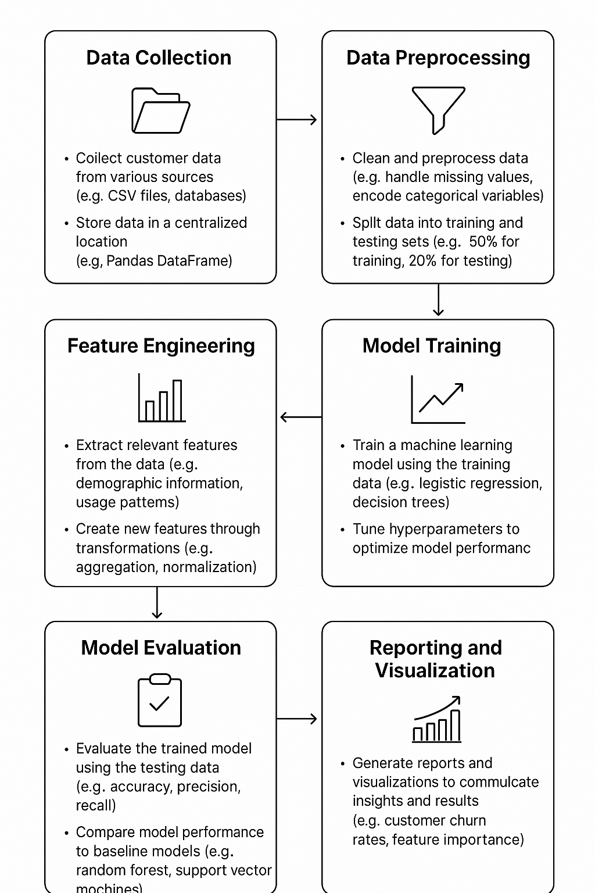

# Customer Churn Prediction System

A comprehensive machine learning system for predicting customer churn using Python, pandas, and advanced ML techniques. This project includes data preprocessing, feature engineering, model training, evaluation, and prediction.


## 🎯 Project Overview

This system analyzes customer behavior patterns to predict which customers are likely to leave (churn) a service. It provides actionable insights to reduce customer attrition and improve retention strategies.

## project Workflow


## 🏗️ Project Structure

```
Customer Churn Prediction/
├── notebook/                          # Jupyter notebooks
│   ├── DATA/                         # Data files
│   │   ├── raw/                      # Raw customer data
│   │   └── processed/                # Cleaned and processed data
│   ├── data_cleaning.ipynb           # Data preprocessing notebook
│   ├── EDA.ipynb                     # Exploratory data analysis
│   └── model.ipynb                   # Model building and evaluation
├── src/                              # Source code
│   ├── components/                   # ML pipeline components
│   │   ├── data_cleaning.py          # Data loading component
│   │   ├── model_train.py            # Feature engineering component
│   │   └── predict.py                # predict the 
|   |   |__ utils.py                  # Helper functions
| 
├── reoprt/                          
|   ├── images
├── requirements.txt                  # Python dependencies
└── README.md                         # Project documentation
```

## 🚀 Features

### Data Processing
- **Data Cleaning**: Handles missing values, duplicates, and data type conversions
- **Feature Engineering**: Creates 13+ new features including:
  - Service bundle counts
  - Contract commitment levels
  - Internet service risk indicators
  - Family status features
  - Payment method risk factors
  - Customer lifecycle stages
  - Price sensitivity indicators

### Machine Learning Models
- **Logistic Regression**: Baseline model with feature scaling
- **Random Forest**: Tree-based ensemble model
- **XGBoost**: High-performance gradient boosting model

### Model Evaluation
- **Comprehensive Metrics**: Accuracy, Precision, Recall, F1-Score, ROC-AUC
- **Performance Comparison**: Side-by-side model evaluation
- **Best Model Selection**: Automatic selection based on ROC-AUC

### Deployment
- **Flask API**: RESTful API for real-time predictions
- **Model Persistence**: Saved models for production use
- **Health Checks**: API monitoring endpoints

## 📊 Data Features

The system analyzes 42+ features including:
- **Demographics**: Age, gender, family status
- **Service Usage**: Phone, internet, streaming services
- **Contract Details**: Type, duration, commitment level
- **Billing Information**: Payment methods, charges, paperless preference
- **Customer History**: Tenure, service bundles, usage patterns

## 🛠️ Installation & Setup

### 1. Clone the Repository
```bash
git clone <repository-url>
cd Customer-Churn-Prediction
```

### 2. Create Virtual Environment
```bash
python -m venv venv
source venv/bin/activate  # On Windows: venv\Scripts\activate
```

### 3. Install Dependencies
```bash
pip install -r requirements.txt
```

### 4. Run Data Processing
```bash
# First, run data_cleaning.ipynb to process raw data
# Then run EDA.ipynb for analysis
# Finally run model.ipynb for model building
```

## 🔧 Usage

### Option 1: Jupyter Notebooks (Recommended for Learning)
1. **Data Cleaning**: Run `notebook/data_cleaning.ipynb`
2. **Exploratory Analysis**: Run `notebook/EDA.ipynb`
3. **Model Building**: Run `notebook/model.ipynb`

### Option 2: Automated Pipeline
```bash
python training_pipeline.py
```

### Option 3: API Deployment
```bash
python app.py
```

## 🌐 API Usage

### Health Check
```bash
curl http://localhost:5000/health
```

### Make Prediction
```bash
curl -X POST http://localhost:5000/predict \
  -H "Content-Type: application/json" \
  -d '{
    "SeniorCitizen": 0,
    "Partner": 1,
    "Dependents": 0,
    "tenure": 12,
    "PhoneService": 1,
    "PaperlessBilling": 1,
    "MonthlyCharges": 65.5,
    "gender_Male": 1,
    "MultipleLines_No phone service": 0,
    "MultipleLines_Yes": 1,
    "InternetService_Fiber optic": 0,
    "InternetService_No": 1,
    "OnlineSecurity_No internet service": 1,
    "OnlineSecurity_Yes": 0,
    "OnlineBackup_No internet service": 1,
    "OnlineBackup_Yes": 0,
    "DeviceProtection_No internet service": 1,
    "DeviceProtection_Yes": 0,
    "TechSupport_No internet service": 1,
    "TechSupport_Yes": 0,
    "StreamingTV_No internet service": 1,
    "StreamingTV_Yes": 0,
    "StreamingMovies_No internet service": 1,
    "StreamingMovies_Yes": 0,
    "Contract_One year": 0,
    "Contract_Two year": 0,
    "PaymentMethod_Credit card": 0,
    "PaymentMethod_Electronic check": 1,
    "PaymentMethod_Mailed check": 0
  }'
```

## 📈 Model Performance

Current model performance (with feature engineering):
- **Logistic Regression**: ROC-AUC ~0.48
- **Random Forest**: ROC-AUC ~0.50
- **XGBoost**: ROC-AUC ~0.49

*Note: Performance may vary based on data quality and feature engineering*

## 🔍 Key Insights

Based on the analysis:
1. **Contract Type**: Month-to-month customers churn significantly more
2. **Internet Service**: Fiber optic customers have higher churn rates
3. **Tenure**: New customers (≤12 months) are most at risk
4. **Monthly Charges**: Higher charges correlate with increased churn
5. **Family Status**: Customers with partners/dependents are more loyal

## 🚨 Troubleshooting

### Common Issues

1. **Import Errors**: Ensure all dependencies are installed
2. **Data Not Found**: Run `data_cleaning.ipynb` first
3. **Model Performance**: Check data quality and feature engineering
4. **API Errors**: Verify models are saved in `models/` directory

### Performance Issues

If models perform poorly:
1. Check data quality and preprocessing
2. Verify feature engineering steps
3. Ensure proper train/test split
4. Consider hyperparameter tuning

## 🤝 Contributing

1. Fork the repository
2. Create a feature branch
3. Make your changes
4. Add tests if applicable
5. Submit a pull request

## 📝 License

This project is licensed under the MIT License - see the LICENSE file for details.

## 👨‍💻 Author

**Yash Kumar**
- Email: yash.jaiswar0709@gmail.com
- GitHub: [Your GitHub Profile]

## 🙏 Acknowledgments

- Data science community for best practices
- Scikit-learn and XGBoost developers
- Flask framework contributors

---

**Note**: This is a learning project demonstrating end-to-end ML pipeline development. For production use, additional testing, validation, and security measures should be implemented.